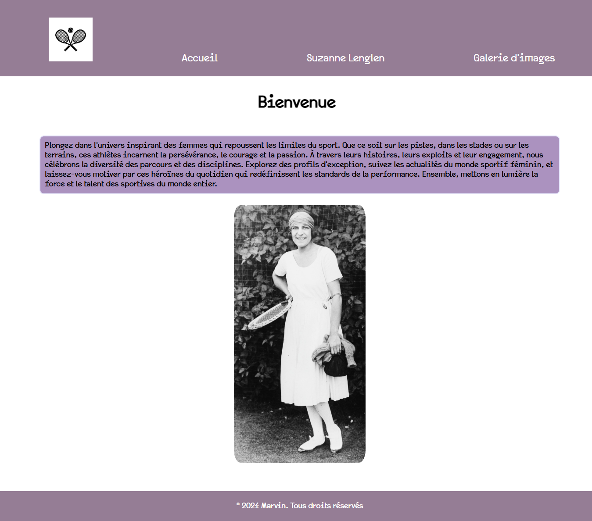

# Suzanne Lenglen et le sport au féminin

## 🌟 Description
Ce projet est un site web dédié à **Suzanne Lenglen**, une icône du tennis et une pionnière du sport au féminin.  
Il met en lumière son impact sur le monde sportif et son rôle dans l'évolution de la place des femmes dans le sport.

## 🎯 Objectifs
- Rendre hommage à Suzanne Lenglen et son héritage.
- Promouvoir l'histoire du sport au féminin.
- Sensibiliser à l'importance de l'égalité dans le sport.

## 🖥️ Contenu du site
- **Page d'accueil**
- **L'histoire de Suzanne Lenglen**
- **Galerie**

## 🚀 Fonctionnalités
- Navigation simple et intuitive.
- Mise en valeur des données historiques et anecdotes.

## 🛠️ Technologies utilisées
- **HTML5** : Structure du site.
- **CSS3** : Design et mise en page.

## 🖼️ Aperçu
  


## 📝 Installation
1. Clonez le dépôt :
   ```bash
   git clone https://github.com/mq2vin/suzanne-lenglen.git
2. Ouvrez le fichier index.html dans votre navigateur.

## 🌐 Hébergement en ligne
Le site est disponible en ligne à l'adresse suivante :
[suzanne-lenglen.pages.dev](https://suzanne-lenglen.pages.dev/)

## 🏅 Contributeurs
* [mq2vin](https://github.com/mq2vin)

